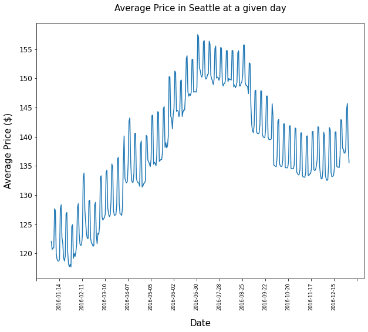
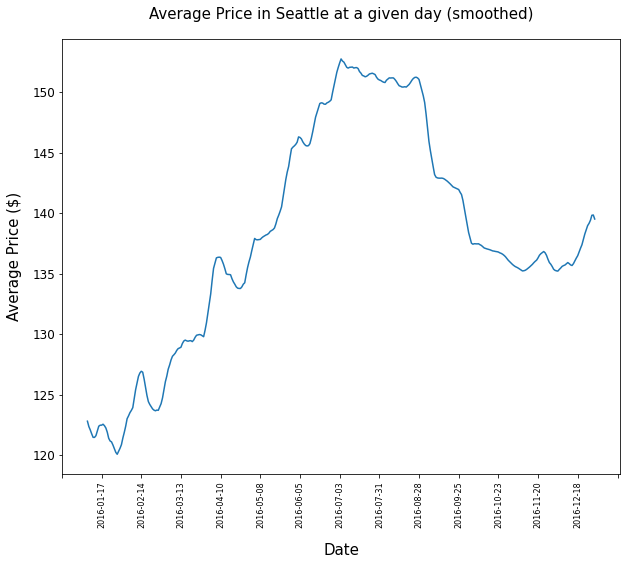
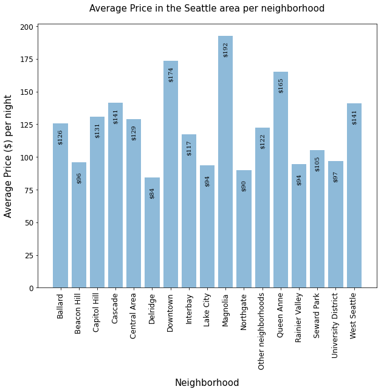
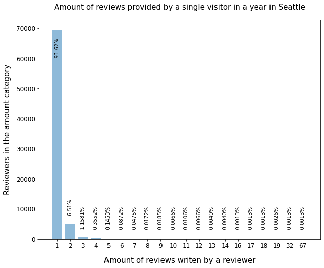

---
Analyzing AirBnb's Seattle data from the perspective of a visitor and AirBnb marketing
---

## Introduction

AirBnb has been an alternative to the traditional hospitality business for a while now. It has started on a very low level, the "air" in AirBnb represents an inflatable mattress that the initial users wanted to rent out in order to make an additional buck. 

Nowadays AirBnb offers a wide range of homes in cities across the planet including luxury homes at a high price. It has become quite a challenge to find really good deals, especially since so many people use the service.

Seattle is quite an expensive city, and, of course, AirBnb provides homes here as well. Being a thrifty person, wouldn't it be great to get access to AirBnb's internal data, analysze the data, and learn about the most affordable times to visit the city and find a moderately priced neighborhood?

Also, for so many people using AirBnb as a service, it would make sense for AirBnb to utilize the power users, i.e. users who frequently stay in Seattle and write reviews. If there is significant output, these users could be turned into some kind of brand ambassadors and contribute to AirBnb's success. Always looking for a good deal, I would be happy to become a brand ambassador myself.

### Available data

I had access to three data sets:

- Listings: This is the master data showing most of the attributes. Major attributes include the location, some policy data, the home description, etc. In total there are 92 attributes for 3818 homes. 
- Calendar: This basically shows the availability of a listing and the price per night. There are in total 1393570 entries with 3818 listings for every day of the year.
- Reviews: A guest is supposed to leave a review for a specific listing a t a specific date. The data set contains 84849 reviews for the Seattle area.

### Interesting Business Questions

1. How do the prices differ during the course of the year? Are there any trends? Are there short term deviations? 
&rarr; Answering this question might help when planning a trip in advance to arrive at an affordable time in the city.
2. Are the there significant price differences between Seattle's neigborhoods? &rarr; Answering this question might help when investing in property or advertising certain areas for customers who are price sensitive. Or, again, as the thrifty customer, finding an area that is affordable.
3. Are there reviewers / travellers who are more active that the average? &rarr; Adressing such reviewers directly and turning them into brand ambassadors might be a cost effective marketing tool. 

## Part I - Price development throughout the year

The calendar data set shows the listings (identified by listing id), the date, the availability, and the price per day for each listing. It spans over a year 2016-01-04 until 2017-01-02 and shows the availability per listing during that year.

Do the prices fluctuate? Let us check a sample listing from the data set.

Taking a random id shows a contant price whenever the listing is available. 

```
	listing_id	date	available	price
0	241032	2016-01-04	t	$85.00
1	241032	2016-01-05	t	$85.00
2	241032	2016-01-06	f	NaN
3	241032	2016-01-07	f	NaN
4	241032	2016-01-08	f	NaN
```
Still there is hope that there is some fluctuation, so let us analyze the complete set of data. In case there wasn't any fluctuation, the average price per day (considering all listings) would remain stable.

After taking the days' avaerage price values after performing some data cleansing, I get the following graph: 



Takeaways from this images:



Takeaways from this images:


## Part II - Most sought after neighborhoods



## Part III - Reviews, How active are the users

Finally I want to learn about the most active reviewers 



## Conclusion and what can we do next?