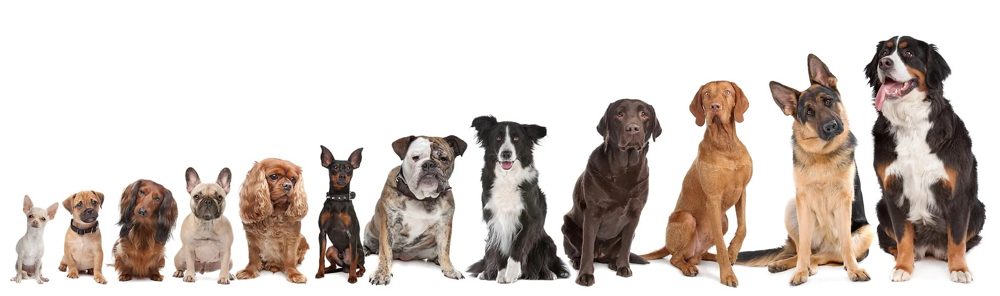

---
Using advanced Deep Neural Networks to identify Dog Breeds

---

## Introduction

This article outlines the development of a dog breed classifier using convolutional neural networks in Python and how to substantially improve the result step by step. A special focus will be on the usage of pretrained neural networks.

We will be working with input images that contain either _human faces_ or _dogs_. 

For dogs we want to find the correct breed, for humans we want to find a dog breed that somehow resembles this human.

The classification will first have to distinguish between humans and dogs - _using different approaches_ - and will then find the corresponding dog breed - _using the same approach for both humans and dogs_.

### Technical Background

For our endavours we will be using Python and a number of specialized frameworks and libraries.

The most important components are OpenCV and Keras.

### OpenCV

[OpenCV](https://opencv.org/) - the Open Source Computer Vision Library - is a library to simplify real-time computer vision tasks. A detailled description is provided at the corresponding [Wikipedia Page](https://en.wikipedia.org/wiki/OpenCV).

We are using OpenCV's [Haar feature based cascade classifier](https://docs.opencv.org/3.4/db/d28/tutorial_cascade_classifier.html) to detect if an image contains a human face or not. Since our input images contain either dogs or human faces this is a first step to reach our goal.

### Keras 
[Keras](https://keras.io/) is a deep learning framework written in Python. It can be used to create Neural Networks in a relatively simple fashion ("Deep learning for humans" is one of their sloagans). However, Keras itself is not sufficient, for the actual execution (training and inference) of neural networks, a backend is needed. In our case (i.e. the Udacity lab environment), Tensorflow is used as the backend.

Keras comes with a number of tools to process data and even provides a large number of pretrained models.

We are using Keras in the following areas:

- a ResNet model that has been trained on ImageNet, a wide collection of images.
- the preprocessing cpapbilities to load images
- create the CNN based neural networks
- use a large pretrained model (one of VGG-19, ResNet-50, Inception, Xception)
- perform training, validation and prediction


## Steps in the development

### Human detector

In order to detect human faces, the OpenCV's Haar feature based classifier is used. If the classifier doesn't find any face in the picture, we will assume the picture in question doesn't show a human.

Applying this strategy to our test set of humans and dogs produces the follwoing result:

```
detection rate for human faces:  100.0 %
detection rate for human faces in dog pictures:  11.0 %
```

This means that we have about 11% of false positives. So we should apply a better approach to be sure that a dog is recognized as a dog and not as a human.

### Dog detector

In order to more reliably detect dogs, we are using the ResNet50 network that can be simply loaded from Keras. 

```
from keras.applications.resnet50 import ResNet50

# define ResNet50 model
ResNet50_model = ResNet50(weights='imagenet')
Downloading data from https://github.com/fchollet/deep-learning-models/releases/download/v0.2/resnet50_weights_tf_dim_ordering_tf_kernels.h5
102858752/102853048 [==============================] - 1s 0us/step
```

It is already trained on Imagenet (a huge collection of pictures) and produces results according to a predefined dictionary. The entries from 151 to 268 correspond to dog breeds:


```
151: 'Chihuahua',
152: 'Japanese spaniel',
153: 'Maltese dog, Maltese terrier, Maltese',
154: 'Pekinese, Pekingese, Peke',
155: 'Shih-Tzu',
156: 'Blenheim spaniel',
157: 'papillon',
158: 'toy terrier',
159: 'Rhodesian ridgeback',
160: 'Afghan hound, Afghan',
161: 'basset, basset hound',
...
...
...
262: 'Brabancon griffon',
263: 'Pembroke, Pembroke Welsh corgi',
264: 'Cardigan, Cardigan Welsh corgi',
265: 'toy poodle',
266: 'miniature poodle',
267: 'standard poodle',
268: 'Mexican hairless',
```

This new dog detector yields much better results:

```
detection rate for dog faces in human pictures:  0.0 %
detection rate for dog faces in dog pictures:  100.0 %
```

### Dog Classifier from Scratch

As a next step in the evolution we want to use a CNN from scratch using Keras in order to classify dog images.

A CNN classifier uses the following approach:

1. Hierarchical spacial features are extracted 
2. The resulting output - i.e. which features have been recognized is then classified and the most likely value is calculated by a softmax layer.

The way hierarchical spacial features can be imagined is visualized in this picture taken from "Deep Learning with Python", by Francois Chollet.


The feature extraction part is basically a stack of Conv2D and MaxPooling2D layers. 

- Conv2D layers: Perform the mathematical operation of convolution is between the input image and a filter of a particular size MxM. By sliding the filter over the input image, the dot product is taken between the filter and the parts of the input image with respect to the size of the filter (MxM).
- MaxPooling2D layers: A Convolutional Layer is usually followed by a Pooling Layer. The primary aim of this layer is to decrease the size of the convolved feature map to reduce the computational costs. This is performed by decreasing the connections between layers and independently operates on each feature map.

The resulting, relatively simple network looks like this:

```
_________________________________________________________________
Layer (type)                 Output Shape              Param #   
=================================================================
conv2d_1 (Conv2D)            (None, 223, 223, 16)      208       
_________________________________________________________________
max_pooling2d_2 (MaxPooling2 (None, 111, 111, 16)      0         
_________________________________________________________________
conv2d_2 (Conv2D)            (None, 110, 110, 32)      2080      
_________________________________________________________________
max_pooling2d_3 (MaxPooling2 (None, 55, 55, 32)        0         
_________________________________________________________________
conv2d_3 (Conv2D)            (None, 54, 54, 64)        8256      
_________________________________________________________________
max_pooling2d_4 (MaxPooling2 (None, 27, 27, 64)        0         
_________________________________________________________________
global_average_pooling2d_1 ( (None, 64)                0         
_________________________________________________________________
dense_1 (Dense)              (None, 133)               8645      
=================================================================
Total params: 19,189
Trainable params: 19,189
Non-trainable params: 0
_________________________________________________________________
```
This network is quite small. 

Training for 10 epoch leads to an accuracy of 4.3062% 

This is better than a random guess - _with 133 dog breeds, a random guess would be below 1%_ - but still this is not good enough.

### Use a pretrained Network for Feature Extraction

In order to achieve better results, we will use a heavily pretrained CNN with a larger amount of nodes.

There are multiple pretrained networks available, we choose a VGG-19 architechture.

Its characteristics are generally: 19 layers (16 convolution layers, 3 Fully connected layer, 5 MaxPool layers and 1 SoftMax layer. 

We complete the feature extraction part with the following components:
- GlobalAveragePooling Layer
- Dense Layer / Dropout Layer: To add some randomness in order to avoid overfitting, i.e. the issue of specializing too much on the training data set
- Dense Layer with SoftMax activation 

The classification part looks like this:
```
_________________________________________________________________
Layer (type)                 Output Shape              Param #   
=================================================================
global_average_pooling2d_6 ( (None, 512)               0         
_________________________________________________________________
dense_9 (Dense)              (None, 128)               65664     
_________________________________________________________________
dropout_4 (Dropout)          (None, 128)               0         
_________________________________________________________________
dense_10 (Dense)             (None, 133)               17157     
=================================================================
Total params: 82,821
Trainable params: 82,821
Non-trainable params: 0
_________________________________________________________________

```
This model reaches an accuracy of 72% after training it for 20 epochs.

### Putting it together and running it

Finally we create a function that first checks if a dog is in the image by invoking the dog detector.

If a dog has been found, then the pretrained network will be used to find the actual breed.

If no dog was found, a check for a human will be performed by using the human face detector. 

If neither a dog nor a human was present in the picture, an error message is thrown.

The simple code:

```
def classify_image(img_path):
    
    result = ""
    # check if dog 
    if (dog_detector(img_path)):
        result = predict_dog_breed(img_path)
    else:
        # if not a dog, perhaps a human face
        if(face_detector(img_path)):
            result = ("A human who looks like a {}".format(predict_dog_breed(img_path)))
        else:
            # not a dog, not a human
            result = 'Neither human nor dog could be found.'
            
    return result
```

Here are examples of images of dogs  that have been used for testing and their prediction:


That looks pretty good. Both the breeds are correct, so the classifier seems to be usable for dogs.

But how are humans classified? How do their facial features correspond to those of dogs?

This is the prediction for some human faces:


And as a reference these are the similar doog breeds:


Dear reader, please judge for yourself - do you think these humans resemble the estimated dogs?

## Conclusions 

We developed an application to predict dog breeds taking images of dogs and humans.

We applied two different technologies to detect the presence of either dogs or humans in the images.

We used CNNs - one from scratch and one using a large pretrained feature extractor - to predict dog breeds. Using the pretrained feature extractor provided a massive improvement and resulted in a usable dog classifier.

Using Keras as framework is surpringly easy.

Estimating dog breeds for human faces is fun, but the result is not very conclusive.

### What could be improved.

From the pretrained models we could have tested all of the available ones. Maybe ResNet-50, Inception or Xception would yield better results. We could have used different pretrained models for humans and dogs. Maybe one of these models would have worked better on the classification of human faces even though we did not use humans as input.

Preprocessing / augmenting the images for classification (not training): Crop images to the bounding boxes that we can produce in OpenCV. That way we can remove noise from the background. We could also classify multiple dogs in one image if there are multiple ones depicted.

Present the likelihood to the user. Right now we only show the most likely dog breed. In case the output vector has a lot of similar values (i.e. there are multiple candidates), this information could also be useful. If the result is ambiguous, another model architecture could be used.

We could train the model with adding some noise, i.e. for instance randomly rotating images by some degrees and similar operations. This way, we can avoid overfitting. Right now we are only using a dropout layer.

In order to substantially improve the human/dog breed matching, we would need labelled training data - something that would be difficult to obtain without a lot of manual work.

## Reference 

For a detailed look at the code, please have a look at the Github repository at [https://github.com/christopherrauh/udacity_dsnd_capstone/](https://github.com/christopherrauh/udacity_dsnd_capstone/)